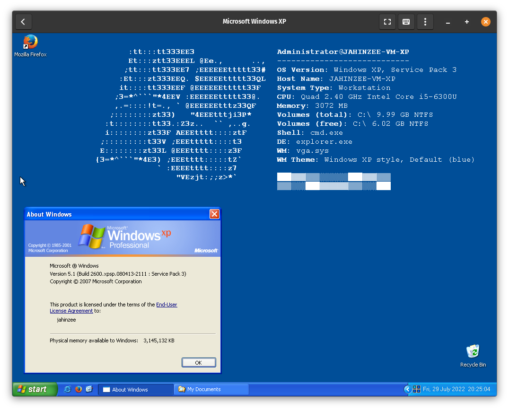

# cursed_neofetch

This is a very cursed demonstration of the Sysinternal's `BGInfo` module, by setting the system wallpaper to to a `neofetch`-inspired display. Currently this is designed for Windows XP.

## Usage

1. Download the Sysinternals Suite. Officially this is available from [Microsoft](https://docs.microsoft.com/en-us/sysinternals/downloads/), but the executables from the latest package may not be compatible with Windows XP, so you may have to get it from elsewhere.
2. Find BGInfo.exe. Run it, accept the licence, and open the `.bgi` file.
3. Customise it to your liking and hit Apply. Best served on a plain blue background.

## Questions

Any questions or queries, drop something in the Issues tab, or get in touch [here](https://jahinzee.github.io/info/contact.html).